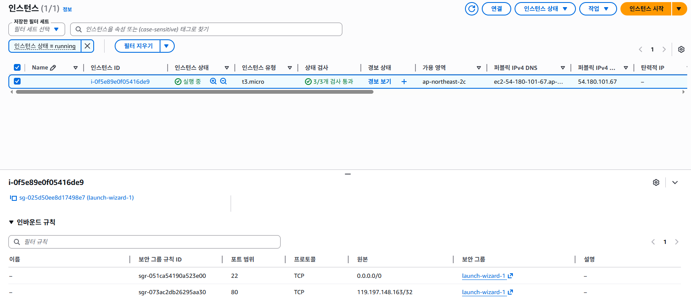
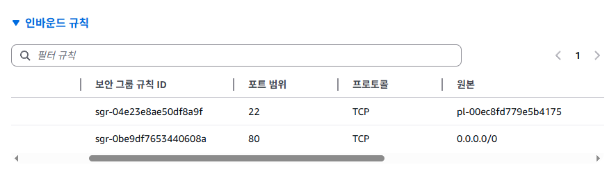
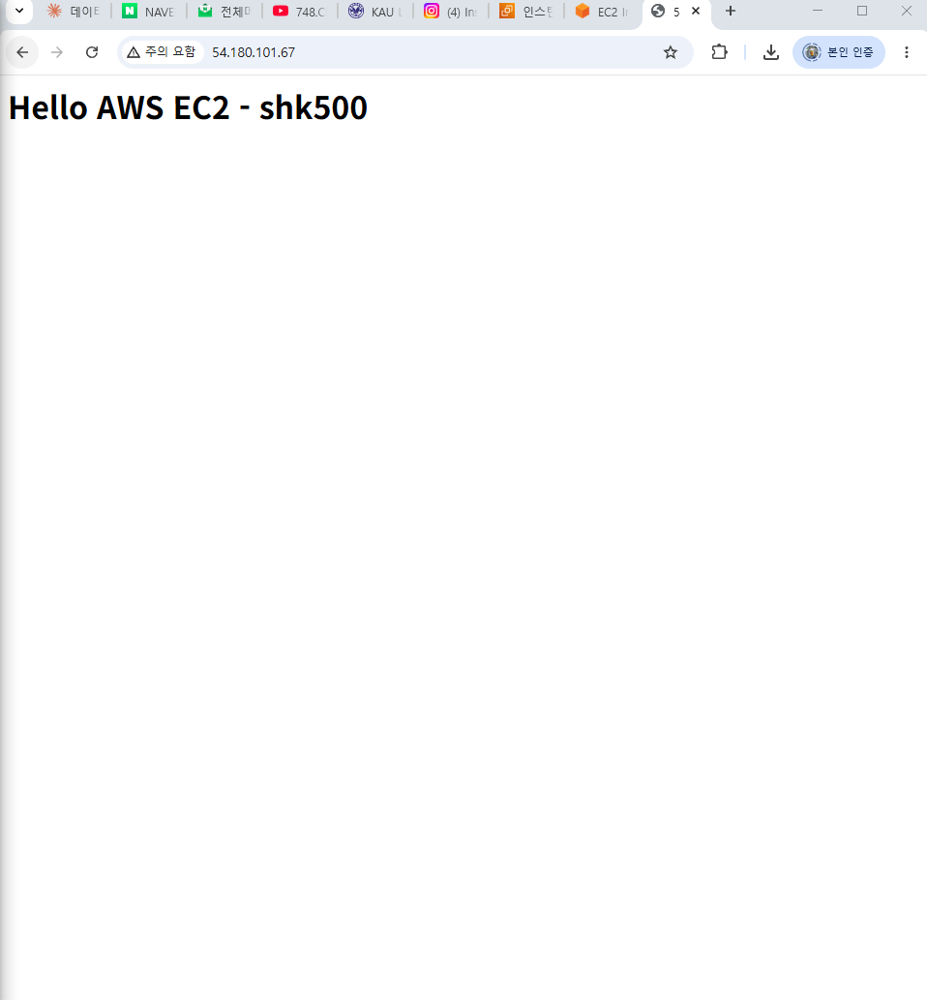
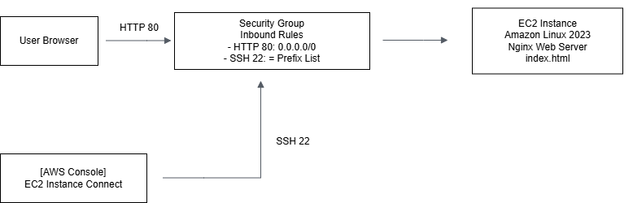

# AWS EC2 기반 웹 서버 구축 실습

## 1. 프로젝트 개요
AWS EC2 인스턴스를 생성하고 Nginx 웹 서버를 설치하여 퍼블릭 IP로 접속 가능한 웹페이지를 배포한 실습입니다.

## 2. 사용 기술
- AWS EC2
- Amazon Linux 2023
- Nginx
- Security Group
- EC2 Instance Connect

## 3. 구축 과정
1. EC2 인스턴스 생성
2. 키 페어 생성
3. 보안 그룹 설정
   - SSH 22번 포트: 내 IP 허용 -> 트러블 -> 인바운드 규칙 변경으로 해결
   - HTTP 80번 포트: 전체 허용
4. EC2 Instance Connect로 서버 접속
5. Nginx 설치 및 실행
6. index.html 수정
7. 퍼블릭 IPv4 주소로 접속 확인
   
## 인스턴스 생성 결과 및 보안 그룹 인바운드 규칙



## 4. 사용 명령어
```bash
sudo dnf update -y 
sudo dnf install -y nginx 
sudo systemctl start nginx 
sudo systemctl enable nginx 
echo "<h1>Hello AWS EC2 - shk500</h1>" | sudo tee /usr/share/nginx/html/index.html
```

## 5. 명령어 설명
| 명령어                                    | 설명                                |
| -------------------------------------- | --------------------------------- |
| `sudo dnf update -y`                   | 서버에 설치된 패키지 목록과 프로그램을 최신 상태로 업데이트 |
| `sudo dnf install -y nginx`            | Nginx 웹 서버 설치                     |
| `sudo systemctl start nginx`           | Nginx 서비스 실행                      |
| `sudo systemctl enable nginx`          | 서버 재시작 시 Nginx가 자동 실행되도록 설정       |
| `tee /usr/share/nginx/html/index.html` | Nginx 기본 웹 페이지 파일 수정              |


## 6. 트러블 슈팅

### 문제 1. EC2 Instance Connect 접속 실패

#### 상황
EC2 인스턴스의 보안을 위해 SSH 22번 포트의 소스를 `내 IP`로 제한했으나, AWS 콘솔의 `EC2 Instance Connect` 기능을 사용해 접속하려고 하면 연결이 실패했다.

처음에는 SSH 22번 포트를 `0.0.0.0/0`으로 열었을 때 접속이 가능했지만, 이는 전 세계 어디서든 SSH 접속 시도가 가능해지는 설정이므로 보안상 적절하지 않다고 판단했다.

#### 원인
`EC2 Instance Connect`는 로컬 PC에서 직접 SSH 접속하는 방식이 아니라, AWS의 EC2 Instance Connect 서비스 경로를 통해 인스턴스에 접속한다.

따라서 보안 그룹에서 SSH 22번 소스를 `내 IP`로만 제한하면 EC2 Instance Connect의 접속 요청이 허용되지 않아 연결이 실패할 수 있다.

#### 해결
SSH 22번 포트를 전체 공개하지 않고 EC2 Instance Connect만 허용하기 위해, 보안 그룹 인바운드 규칙의 소스를 EC2 Instance Connect 전용 Prefix List로 설정했다.

기존 SSH 규칙은 IPv4 CIDR 규칙이었기 때문에 Prefix List로 바로 수정할 수 없었다.  
따라서 기존 SSH 22번 규칙을 삭제한 뒤, 새 SSH 규칙을 추가하여 소스를 Prefix List로 지정했다.

```text
pl-00ec8fd779e5b4175
```

## 7. 결과
퍼블릭 IPv4 주소로 접속했을 때 "Hello AWS EC2 - shk500" 페이지가 정상적으로 출력됨


## 8. 구조 정리


사용자 브라우저는 HTTP 80번 포트를 통해 EC2 인스턴스의 Nginx 웹 서버에 접속한다.  
관리자는 AWS Console의 EC2 Instance Connect를 사용해 SSH 22번 포트로 접속하며, SSH 접근은 EC2 Instance Connect Prefix List로 제한했다.
