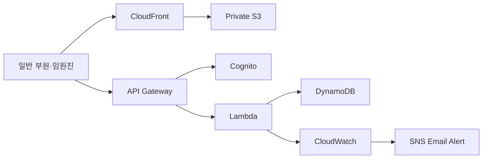

# HI-HIGH 활동 신청 시스템

대학생 봉사 동아리의 수기 신청, 대기자 승격, 대타 관리 업무를 개선하기 위해 구축한 AWS 서버리스 웹 애플리케이션입니다.

## Architecture

- Frontend: S3, CloudFront
- Backend: API Gateway, Lambda
- Database: DynamoDB
- Authentication: Cognito
- Infrastructure as Code: AWS SAM, CloudFormation
- Monitoring: CloudWatch, SNS

## Key Features

- 일반 부원·기자단 활동 신청 및 정원 관리
- DynamoDB 조건부 처리로 동시 신청 시 정원 초과 방지
- 취소 시 대기자 자동 승격 및 대타 필요 상태 관리
- Cognito 기반 임원진 인증과 관리자 기능 분리
- 활동·신청자 관리, CSV 내보내기, 안전한 활동 삭제
- API Gateway 5XX, Lambda Error, Throttle 경보 구성

## Design Decisions

- 운영 서버 관리 부담과 소규모 트래픽 비용을 줄이기 위해 서버리스 구조를 선택했습니다.
- 정적 프론트엔드는 비공개 S3에 저장하고 CloudFront를 통해서만 제공했습니다.
- 일반 사용자 기능과 관리자 기능을 분리하고 Cognito 토큰으로 관리자 API를 보호했습니다.
- SAM과 CloudFormation으로 인프라를 코드화해 동일한 구성을 다시 배포할 수 있도록 했습니다.

## Troubleshooting

활동 삭제 API에서 5XX 오류가 발생했을 때 CloudWatch 경보와 Lambda 로그를 통해 원인을 추적했습니다.  
삭제 Lambda에 필요한 DynamoDB `GetItem` 권한이 누락된 것을 확인하고, IAM 정책에 해당 권한만 추가한 뒤 SAM으로 재배포하여 해결했습니다.

이 과정을 통해 API 지표, 애플리케이션 로그, IAM 최소 권한 정책을 연결해 장애를 진단했습니다.

## What I Learned

- 서버리스 웹 요청 흐름과 AWS 관리형 서비스의 역할
- Cognito 인증과 IAM 권한 부여의 차이
- DynamoDB 조건부 처리와 동시성 제어
- SAM·CloudFormation 기반 Infrastructure as Code
- CloudWatch 기반 모니터링과 장애 대응

