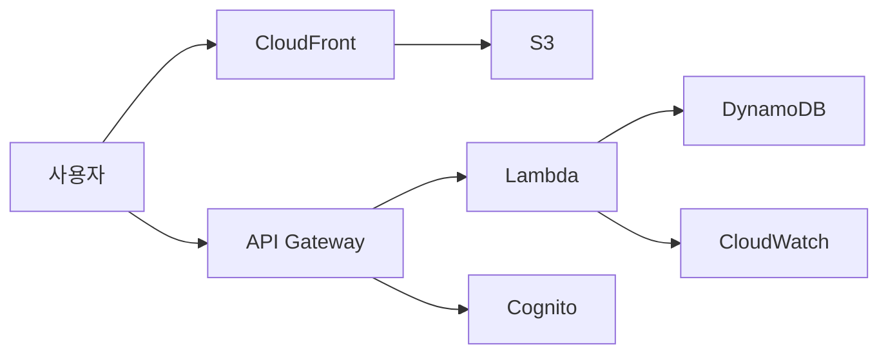

# HI-HIGH 활동 신청 시스템

동아리 활동 신청을 카카오톡 댓글로 받으면서 생기던 수기 확인, 선착순 정리, 대타 모집 문제를 줄이기 위해 만들었습니다.

약 50명 규모의 동아리에서 사용하는 것을 기준으로 AWS 서버리스 구조를 선택했습니다.

## 구조

- S3와 CloudFront: 웹페이지 제공
- API Gateway와 Lambda: 신청·취소·관리 기능 처리
- DynamoDB: 활동 및 신청 정보 저장
- Cognito: 임원진 로그인
- SAM·CloudFormation: AWS 리소스 배포
- CloudWatch·SNS: 오류 감지 및 이메일 알림

## 구현하면서 신경 쓴 부분

### 동시 신청

여러 명이 동시에 신청해도 정원이 초과되지 않도록 DynamoDB 조건부 업데이트를 사용했습니다.

### 취소와 대타

확정자가 취소하면 대기자를 자동으로 승격합니다. 대기자가 없으면 임원진 화면에 대타가 필요한 활동으로 표시하도록 구성했습니다.

### 관리자 권한

일반 신청 기능과 관리자 기능을 분리했습니다. 관리자 API는 Cognito 로그인 토큰이 있어야 접근할 수 있습니다.

## 장애 해결 경험

활동 삭제 기능을 배포한 뒤 API Gateway에서 5XX 오류가 발생했습니다.

CloudWatch 경보와 Lambda 로그를 확인해 보니 삭제 Lambda에 DynamoDB `GetItem` 권한이 빠져 있었습니다. IAM 정책에 필요한 권한만 추가하고 다시 배포해 해결했습니다.

이 경험을 통해 화면의 오류 메시지만 보는 것이 아니라 API Gateway, Lambda 로그, IAM 정책을 순서대로 확인하는 방법을 배웠습니다.

## 사용 기술

AWS SAM, CloudFormation, S3, CloudFront, API Gateway, Lambda, DynamoDB, Cognito, IAM, CloudWatch, SNS, JavaScript
